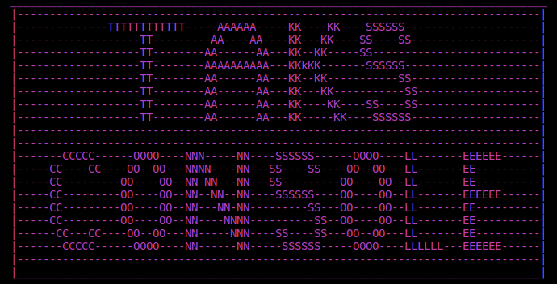
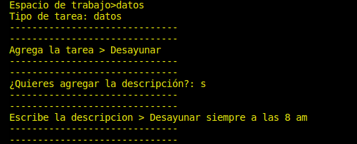
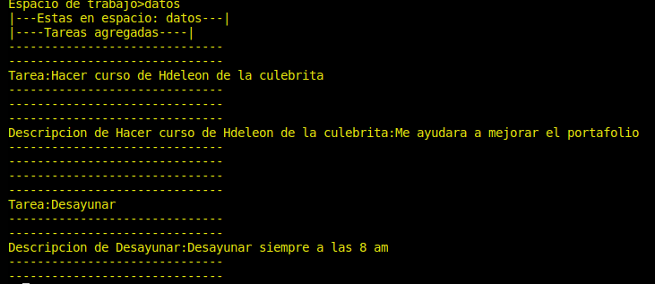
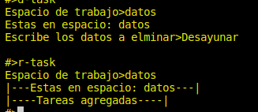
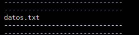

# 

Application to Add, Search and delete tasks only from the console, it is planned to add AI in future versions, but it is V.00, I hope that this simplicity of the application is to your liking

## <li>Tasks of any type can be created, queried and deleted</li>

## <li>Task spaces with local files can be created</li>

## <li> Tiene sus propios comandos
<li>a-task = para agregar una tarea
<li>r-task = para leer todas las tareas
<li>d-task = Para eliminar una o varias tareas
<li>cl = para limpiar pantall
<li>ext = para salir del programa